## 这个是课程设计的工程文件 项目名:小鱼成长游戏 目前版本 1.0 ##

**摘要：**

如今，人们常常需要游戏来放松自己。而在日益加快的生活节奏下，人们对游戏的要求也渐渐有了一些变化，一些简单有趣的小游戏开始越来越受欢迎。它们玩法简单，入手快，不需要花费大量时间和精力来钻研技巧；节奏清新明快，让人感到轻松；舍弃了对复杂生活情境的模拟以及对高深莫测的科技、魔法世界的探索，而转而成为了人们茶余饭后，花一两分钟，就能轻松获得快乐的工具。愤怒的小鸟就是这样一个典型的例子。这次，我设计的是另一款经典的放松类小游戏——大鱼吃小鱼。

“小鱼成长游戏”的操作相当简单，用鼠标控制一条小鱼，移动鼠标来带动它，通过吃掉不同的比自己小的鱼来获取分数，并长大成更大的鱼，以获取吃掉更大的鱼的能力，同样的，当玩家被更大的鱼碰撞的时候，就会被更大的鱼吃掉。看似不复杂的游戏其实也考验了玩家的反应能力：屏幕以外会突然钻出大鱼，而玩家需要快速躲开这致命的威胁；而恰恰比自己小的鱼则是升级的最佳食物，但这样的鱼往往不会太多，玩家需要划出完美的路线去躲开更大的鱼，来吃到最肥的食物。这些游戏内容无疑能够让玩家在短暂的游戏时间内集中精力，从而获得游戏的刺激与快乐。

另外，这款游戏的素材虽然简单，却都使用了萌系的画风，这样的画风能给玩家一种轻松的感觉，很适合在疲惫的工作之余放松。

**关键词:**大鱼吃小鱼;设计;设计模式;扩展性

**第一章 主要任务功能及完成情况**

主要功能描述**:**
小鱼成长游戏是一个玩家通过操控一条小鱼避开大鱼吃掉比自己小的鱼的慢慢成长的游戏.该游戏创意在2010年前后风靡一时,简单的玩法,多种多样的鱼类让这个游戏的趣味性提高了不少.

| 功能             | 完成情况 | 说明           |
|------------------|----------|----------------|
| 显示游戏场景     | √        |                |
| 显示鱼           | √        |                |
| 显示玩家         | √        | 单例模式       |
| 碰撞处理         | √        |                |
| 分数计数         | √        |                |
| 分数显示         | √        |                |
| 鱼的生成         | √        | 使用了工厂模式 |
| 鱼的路径和生成   | √        | 使用策略模式   |
| 玩家的控制       | √        | 键盘           |
| 开始界面         | √        |                |
| 结束界面         | √        |                |
| 关卡的设置       | √        |                |
| 过关或者失败检测 | √        |                |
| 越界处理         | √        |                |
| 统一的资源管理   | √        | 单例模式       |

**第二章 开发平台介绍**

**1.开发语言:**

C\#（读做C-sharp）编程语言是由微软公司的Anders Hejlsberg和 Scott
Willamette领导的开发小组专门为.NET平台设计的语言，它可以使程序员移植到.NET上。这种移植对于广大的程序员来说是比较容易的，因为C\#从C，C++和Java发展而来，它采用了这三种语言最优秀的特点，并加入了它自己的特性。C\#是事件驱动的，完全面向对象的可视化编程语言，我们可以使用集成开发环境来编写C\#程序。使用IDE，程序员可以方便的建立，运行，测试和调试C\#程序，这就将开发一个可用程序的时间减少到不用IDE开发时所用时间的一小部分。使用IDE迅速建立一个应用程序的过程称为快速反映开发。

. NET 是 Microsoft 的 XML Web 服务平台。不论操作系统或编程语言有何差别，XML Web
服务能使应用程序在 Internet 上传输和共享数据。若是单纯以概念来说，你可以把
.NET当做一个工作平台一般，它是一个开发环境的基底，提供了解其运作的相关机制那是有助于你利用它来开发。C\#和
.NET主要是应用在网际网路。

**2.开发框架**

XNA,是一套微软开发的游戏开发引擎,XNA中的X表示能够在WindowsXbox和合作伙伴之间达到跨平台的强大的软件工具。N表示“下一代（Next-generation）”，A表示“架构（Architecture）”。XNA是基于DirectX的游戏开发环境，是微软对于
Managed DirectX 的修正及扩充版本。XNA Game Studio Express
是专业跨平台整合型游戏开发套件「XNA Studio」的简化版，以「Visual C\# Express
2005」为基础，并针对业余创作者加以改良，提供简易的开发环境与详细的教学文件。

**第三章 游戏设计**

游戏开发中,一般都有以下几个基础概念:玩家,敌人,资源,关卡,做了详细的思考后,做出以下设计,其中大部分设计是为了以后的扩展所准备的,所以现阶段不免看起来类有点多,很多类在现阶段并没有展现出其真正的用途.(PS:由于游戏起初设计的时候是按照球球大作战作为范本,所以取名都用ball代替)

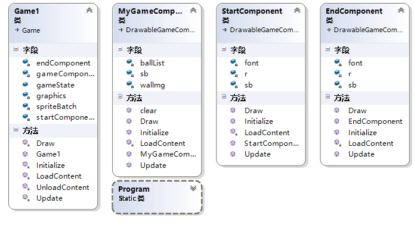

图3-1 三大主类UML图

如图3-1所示,这个是游戏主要的三个类,和一个自动生成的游戏类和Program类,三个新类分别为MyGameCompnent,StartCompnent,EndCompnent.

MyGameCompnent:这个是游戏的主要类,用于处理游戏中的所有游戏情况,在这里组合各个其他类的工作,类中有个用来存储游戏中鱼的list,和一个墙管理器.

StartCompnent:游戏启动类,现在只用来简单实现显示游戏启动画面

EndCompnent: 游戏结束类,现在只用来简单实现显示游戏结束画面

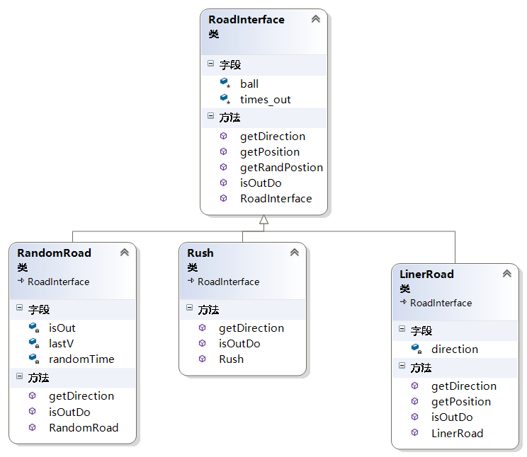

图3-2 路径器UML图

如图3-2实现了路径器算法族

RoadInterface:路径器基类,抽象了3个方法

>   getDirection:路径生成算法,用于设置不同的路径算法

>   getPostion:初始位置生成算法.,用于设置鱼的初始生成位置

>   getRandPostion:位置生成算法的一个默认实现,用于实现随机边界位置生成鱼

>   isOutDO:越界处理算法,用于实现不同的越界效果

RandomRoad:继承RoadInterface,该类实现了随机生成鱼和鱼的随机移动

Rush: 继承RoadInterface,该类实现了随机生成鱼,鱼的路径是追随玩家行动路径

LinerRoad: 继承RoadInterface,,该类实现了在上下边界生成鱼,并垂直移动

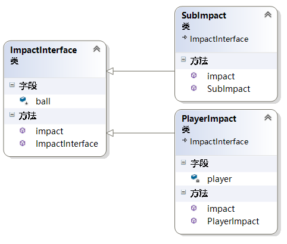

图3-3 碰撞器UML图

如图3-3实现了碰撞器算法族

ImpactInterface:碰撞器基类,实现了基础鱼碰撞后的行为

PlayerImpact:玩家碰撞器,实现了玩家碰撞后的行为,如加分,过关检测等

SubImpact:减法碰撞器,实现了碰撞后玩家分数减少的功能

如图3-4所示这个是游戏设计中的一大类之一.

BaseBall类:这个是所有鱼类的基类,其中实现了大部分鱼的功能,其中生成算法(getPostion)和路径算法(getDirection)被分离了出去,这两个算法被分离到了路径器中,方便以后增加更多行动完全不同的鱼类.

PlayBall类:这个类继承自BaseBall,其中实现了玩家控制该球的部分,并且加了生命数和死亡处理.

其他类的设计如图3-5

Chapters:关卡管理类,用于统一存储并共享关卡信息.有个内部关卡类.

Resourse:资源类,用于统一载入和管理资源,如纹理贴图和字体等

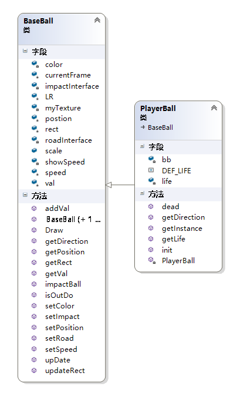

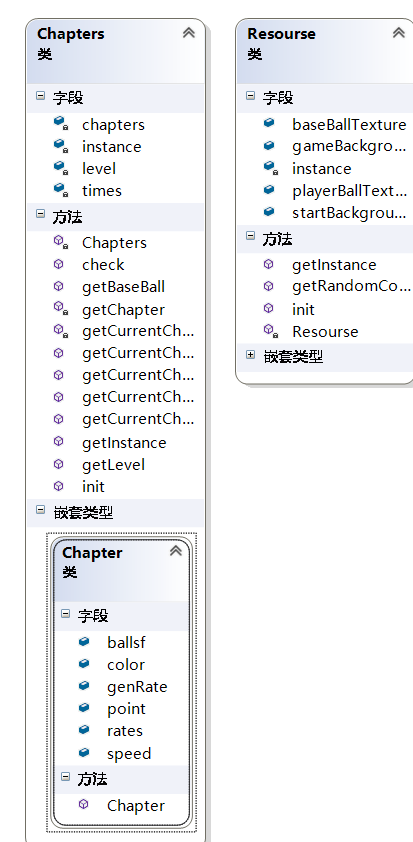

图3-4 基础鱼类UML图 图3-5 关卡类和资源类UML图

**第四章 游戏场景设计**

游戏的场景设计,由于是个小游戏设计,采用了比较简单的设计方式,鱼的贴图自己手绘了一个,采用了比较可爱的画风,背景采用一副海底的图片,增加了游戏的代入感.

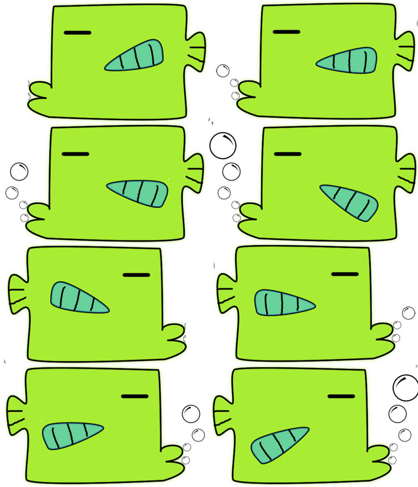

图4-1 鱼的模型图

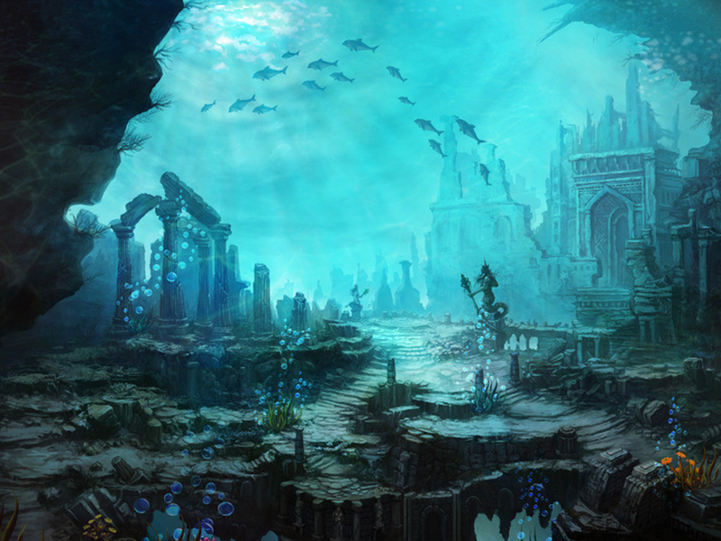

图4-2 游戏背景图

音乐:

背景音乐采用了超级马里奥水下关卡的背景音乐,让玩家有一种亲切感,而且曲调也很适合这种休闲游戏

死亡音效采用的是超级马里奥死亡后的音效

得分音效用了一个欢快的效果音,能在玩家得分后更好的给予玩家反馈信息.

**第五章 游戏关键部分实现**

5.1.策略模式的运用

游戏的趣味性可以通过多样性来提高,一个游戏中多样性越高,往往趣味性会随之提高,所以代码设计的时候,需要注意多样性的实现,这要求我们应该讲代码中以后会改变的部分都抽象出来,方便以后修改和增加,经过反复思考,最后决定在鱼的生成和路径上下功夫,将生成和路径的算法代码分离,选择了使用策略模式解决解耦的问题.

策略模式:
策略模式，又叫算法簇模式，就是定义了不同的算法族，并且之间可以互相替换，此模式让算法的变化独立于使用算法的客户。策略模式的好处在于你可以动态的改变对象的行为。设计原则是把一个类中经常改变或者将来可能改变的部分提取出来，作为一个接口，然后在类中包含这个对象的实例，这样类的实例在运行时就可以随意调用实现了这个接口的类的行为。策略模式属于对象行为型模式，主要针对一组算法，将每一个算法封装到具有共同接口的独立的类中，从而使得它们可以相互替换。策略模式使得算法可以在不影响
到客户端的情况下发生变化。通常，策略模式适用于当一个应用程序需要实现一种特定的服务或者功能，而且该程序有多种实现方式时使用。

这个模式涉及到三个角色：

环境(Context)角色：持有一个Strategy的引用。

抽象策略(Strategy)角色：这是一个抽象角色，通常由一个接口或抽象类实现。此角色给出所有的具体策略类所需的接口。

具体策略(ConcreteStrategy)角色：包装了相关的算法或行为。

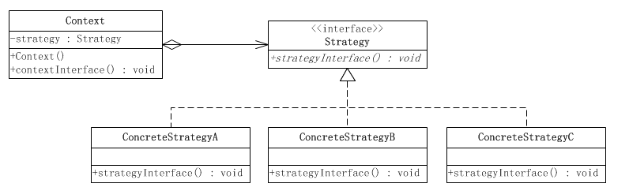

图5-1 策略类UML图

根据策略模式的设计,我设计并完成了一个超类和三个实现类,分别实现了不同的路径算法.

下面是部分代码:

超类RoadInterface部分代码:

public virtual Vector2 getDirection()

{

return Vector2.Zero;

}

public virtual Vector2 getPosition()

{

return getRandPostion(new Rectangle(0, 0,

(int)(ball.getRect().Width\*ball.scale),

(int)(ball.getRect().Height\*ball.scale)));

}

public virtual Boolean isOutDo()

{

//该方法在球超界后调用,返回值表示是否清除

times_out++;

if (times_out \< 5)

{

return false;

}

else {

return true;

}

}

public Vector2 getRandPostion(Rectangle rect)

{

//默认球生成位置算法 (随机)

int ran = new Random().Next() % 4;

Vector2 v = Vector2.Zero;

switch (ran)

{

case 0:

v = new Vector2(rect.Width,

(float)(new Random().Next((int)(WallManager.wallRect.Height - rect.Width))));

break;

case 1:

v = new Vector2(new Random().Next((int)(WallManager.wallRect.Width -
rect.Width)),

rect.Width);

break;

case 2:

v = new Vector2(WallManager.wallRect.Width - rect.Width,

new Random().Next((int)(WallManager.wallRect.Height - rect.Height)));

break;

case 3:

v = new Vector2(new Random().Next((int)(WallManager.wallRect.Width -
rect.Width)),

WallManager.wallRect.Height - rect.Height);

break;

}

return v;

}

该类有个ball变量,用于存储使用了该算法的鱼对象,算法中通过该变量可以获得关于鱼的一些信息,从而实现更多的生成算法等

direction变量,
从getDiretion方法可以看出这变量是用于碰到墙壁后用来反弹用的变量,只取1或者-1,分别代表了正方向和负方向.

getPosition是用于获得位置的算法实现,给了一个默认实现,是随机在屏幕周围生成.

具体实现方法:有以下四种可能,生成在屏幕左边,生成在屏幕右边,生成在屏幕上边,生成在屏幕下边,全部四种可能都不能直接生成左边中包含0,因为如果包含了0的话,在后面的处理边界部分会出现问题,如果出现0,会直接认为碰撞了墙壁,从而改变了方向,而不会在屏幕中显示,或者出现频率很高的闪动等,所以我们生成的时候,需要生成一个起始坐标最起码可以容纳下一个鱼大小的边界才行,从代码中就可以看出来

如:

new Vector2(rect.Width,

(float)(new Random().Next((int)(WallManager.wallRect.Height - rect.Width))));

可以看出,X坐标是鱼的宽度,而Y坐标是用一个随机数去剪掉鱼的宽度,这也是为了不要出现Y坐标是窗口高度,这样也会像前面叙述的那样,边界处理会出问题

随机路径类RandomRoad的部分代码:

private Vector2 lastV;//上次的方向

private int randomTime;

public override Vector2 getDirection()

{

randomTime--;

Random r = new Random();

if (randomTime \<= 0)

{

randomTime = new Random().Next(100);

lastV = new Vector2(r.Next(-2, 2), r.Next(-2, 2));

}

return lastV;

}

直接看随机方向生成算法,Randomtime这个变量是用来延长鱼在某个方向行走的时间,如果没有这个变量,那么每次更新的时候,都会改变行动方向,这样会出现高频率的选择方向,会出现鱼在一个地方附近不停闪动,所以设置了这个变量,每当这个变量归零,才会新生成一个随机方向,并且,这个值到0后,会随机再取一个值,这样才会显得不那么规律,.否则会出现太规律的不自然感.

冲锋类Rush:

public override Vector2 getDirection()

{

Vector2 v = (PlayerBall.getInstance().getPosition() - ball.getPosition());

Console.WriteLine(v);

return v / v.Length();

}

冲锋算法类的实现比较简单,通过玩家类获得玩家的鱼所在位置,然后通过和ball的位置做个减法,就得到了鱼指向玩家所在位置的向量,然后将该向量单位化,这样得到的方向就可以直接指向玩家,实现鱼向玩家冲过来的效果.

直线路径类 LinerRoad:

private int direction = 1;//

public override Vector2 getDirection()

{

return new Vector2(direction\*1,0 );

}

public override Vector2 getPosition()

{

return getLinerPostion(new Rectangle(0, 0,

(int)(ball.getRect().Width \* ball.scale),

(int)(ball.getRect().Height \* ball.scale)));

}

public override bool isOutDo()

{

times_out++;

if (times_out \< 6)

{

direction \*= -1;

return false;

}

else

{

return true;

}

}

private Vector2 getLinerPostion(Rectangle rect)

{

return new Vector2(rect.Width,

(float)(new Random().Next((int)(WallManager.wallRect.Height - rect.Width))));

}

这个类实现了新的位置生成和方向生成算法,先说位置生成算法.

Vector2 v = new Vector2(new Random().Next(WallManager.wallRect.Width),
ball.getRect().Height \* ball.scale);

生成一个在上边界的鱼,然后向下移动,而到达边界后,direction会取相反数,正好改变方向

碰撞器也采用了策略模式:

ImpactInterface 碰撞器超类:

class ImpactInterface

{

protected BaseBall ball;

public ImpactInterface(BaseBall ball)

{

this.ball = ball;

}

public virtual Boolean impact(BaseBall otherBall) {

if (ball.getVal() \< otherBall.getVal())

{

otherBall.addVal(ball.getVal()/10);

return true;

}

else {

return false;

}

}

}

碰撞后回调impact函数,这个函数给了个默认实现,即大鱼会获得小鱼十分之一的分数,返回值代表了这个鱼是否应该被清除(死亡).

构造函数中,依旧是传入了该鱼对象,从中可以获得关于鱼的信息用于算法的编写.

SubImpact减分碰撞器:

public override bool impact(BaseBall otherBall)

{

if (ball.getVal() \< otherBall.getVal())

{

otherBall.addVal(-ball.getVal() / 10);

return true;

}

else

{

return false;

}

}

继承碰撞器超类,实现了大鱼吃掉小鱼后分数减小的碰撞效果.

通过前面的详细解释说明,采用了策略模式后,代码的耦合性减少了许多,以后要添加新的鱼的路径算法或者位置生成算法的时候,就不用改原来的代码,可以直接继承该类就可以实现相应的算法即可,这个符合开闭原则(即对扩展开放,对修改关闭).

5.2.策略模式和组合的运用

游戏中的鱼应该是多种多样的,这样才能更好的保证有趣的趣味性,前面已经采取了策略模式,将碰撞和路径的动作算法从鱼的基类中抽离出来了,但如果只是简单的抽离出来并不能提高多样性,我们通过组合的方式,就可以赋予鱼各种各样的行为.鱼的基类(BaseBall)中,有一个碰撞器和路径器的引用,这意味着,我们可以任意组合他们的行动和碰撞行为,而且甚至是在游戏中动态的修改(现阶段代码中并没有例子实现这个效果,但实现起来异常的简单).

5.3.工厂模式的运用

由于出现了多种多样的组合形式,我们这个时候很需要一个统一的方法去生成鱼,这个时候就用到了工厂模式,下面介绍一下工厂模式,广义工厂模式有三种:简单工厂模式,工厂模式,抽象工厂模式,我采用了比较简单容易理解的简单工厂模式.

 简单工厂模式：

实现了算法和界面的分离，也就是将业务逻辑和界面逻辑分开了，降低了耦合度。

算法的封装：  定义一个抽象的算法接口，提供不同算法的公共接口方法。其他具体算法继承这个抽象类，并实现具体的算法。

简单工厂类：  作为一个独立的类，实现了针对不同的算法进行实例化。

工厂模式：

 定义一个用于创建对象的接口，让子类决定实例化哪一个类。  遵循了开放—封闭原则。

 抽象工厂模式：

   提供一个创建一系列相关或相互依赖对象的接口，而无需指定它们具体的类。

下面是我实现的一个鱼工厂类(BallFactory):

/\*球工厂类,用于生成特定组合形式的球

\*/

class BallFactory

{

private String impactType;//碰撞器

private String roadType;//路径器

private Resourse.MyTexture texture;//纹理

private Color color=Color.White;//颜色

private int val;

public BaseBall built(int val) {

BaseBall ball = new BaseBall(color,Vector2.Zero,0,texture,val);

ball.setColor(color);

switch(impactType){

case "SubImpact":

ball.setImpact(new SubImpact(ball));

break;

default:

ball.setImpact(new ImpactInterface(ball));

break;

}

switch(roadType){

case "Rush":

ball.setRoad(new Rush(ball));

break;

case "RandomRoad":

ball.setRoad(new RandomRoad(ball));

break;

case "LinerRoad":

ball.setRoad(new LinerRoad(ball));

break;

default:

ball.setRoad(new RandomRoad(ball));

break;

}

return ball;

}

}

我们先看构造函数,构造函数中给了4个参数, BallFactory(Resourse.MyTexture
texture,Color c , String impactType, String roadType)

>   texture参数指定了生成鱼的纹理图

>   c参数指定了纹理图的渲染颜色(白色的时候不渲染额外颜色,保持原图)

>   impactType指定了生成鱼的碰撞器

>   roadType指定了生成鱼的路径器

根据以上参数,即可组合构造出所需要类型的鱼,由于鱼的分数在游戏中应该动态指定,我将鱼的分数这个参数调整到了built函数中,只有在真正要生成前才会指定数值,代码比较简单,不详细分析了.

3.4.其他关键部分实现

BaseBall鱼的超类:

namespace BallBattle

{

class BaseBall

{

protected Vector2 postion=Vector2.Zero;//当前位置

protected int speed;//速度

protected Rectangle rect;//球的大小(检测碰撞)

public float scale;//用于缩放

protected int val;//先假设val从1-100分吧,分数决定大小

protected Point currentFrame;//当前播放到的动画位置

private Resourse.MyTexture myTexture;

private ImpactInterface impactInterface;//碰撞器

private RoadInterface roadInterface;//路径器

private Color color=Color.White;

private int showSpeed = 9;

protected int LR = 0;//鱼的左右方向

/\*

更新动画状态

\*/

public void upDate(Rectangle rect) {

updateRect();

postion += (getDirection() \* speed);

showSpeed++;

if(showSpeed\<10){

return ;

}

currentFrame.X++;

if (currentFrame.X \> myTexture.sheetSize.X)

{

currentFrame.X = 1;

currentFrame.Y++;

if (currentFrame.Y \> myTexture.sheetSize.Y)

{

currentFrame.Y = 1;

currentFrame.X = 1;

}

}

showSpeed = 1;

}

public Boolean impactBall(BaseBall ball) {

return impactInterface.impact(ball);

}

virtual public Vector2 getDirection() {

Vector2 v=roadInterface.getDirection();

if (v.X \> 0)

{

LR = 0;

}

else {

LR = 1;

}

return v;

}

public void Draw(SpriteBatch spriteBatch) {

spriteBatch.Draw(myTexture.texture,

postion,

new Rectangle((currentFrame.X - 1) \* myTexture.frameSize.X,

(currentFrame.Y - 1) \* myTexture.frameSize.Y,

myTexture.frameSize.X,

myTexture.frameSize.Y),

color,

0,

Vector2.Zero,

scale,

LR==1?SpriteEffects.None:SpriteEffects.FlipHorizontally,

1);

}

public void updateRect() {

//更新球大小(碰撞体积)

this.rect.X = (int)postion.X;

this.rect.Y = (int)postion.Y;

this.rect.Height = (int)(val \* (100 / (WallManager.wallRect.Height / 4.0)));

this.rect.Width = this.rect.Height;

scale = ((float)this.rect.Height) / myTexture.frameSize.Y;

}

virtual public Boolean isOutDo() {

if (roadInterface == null)

{

return true;

}

else {

return roadInterface.isOutDo();

}

}

}

}

updateRect这个函数,这个函数的功能是用来更新碰撞区块大小和显示的缩放大小,基本思想是窗口高度分成400份,1份代表1分对应的大小,再根据当前鱼的val来算出要显示的大小即可.

Draw函数实现了动画效果,具体算法如下,我们先看代码:

public void Draw(SpriteBatch spriteBatch) {

spriteBatch.Draw(myTexture.texture,

postion,

new Rectangle((currentFrame.X - 1) \* myTexture.frameSize.X,

(currentFrame.Y - 1) \* myTexture.frameSize.Y,

myTexture.frameSize.X,

myTexture.frameSize.Y),

color,

0,

Vector2.Zero,

scale,

LR==1?SpriteEffects.None:SpriteEffects.FlipHorizontally,

1);

}

第一个参数指定了显示的纹理,第二个参数是显示的位置,第三个参数是实现动画效果的核心部分,这个参数是一个矩形区域,当指定了该参数时候,将会绘制该矩形的范围内的纹理,而不是全部,我们可以利用这个参数,在源纹理图中,加入多个静态图,按照一定频率更新显示的图像,就可以实现动画效果.根据以上叙述我们知道,我们应该知道一个纹理图包含了多少行和多少列的静态图,还需要知道每幅静态图的长宽.所以我在全局资源类(Resourse)中定义一个内部类,用于存储单一纹理类,这个类中存储了上面一个纹理所需要的所有信息.

回到我们的动画效果,
currentFrame变量用于记录当前显示到的静态图的位置,包括行和列.所以我们显示的静态图的起始点坐标的X应该是当前显示纹理位置的X减去1的结果再乘以每幅静态图的宽度,Y应该是当前显示纹理位置的Y减去1的结果再乘以每幅静态图的高度,显示的矩形区块的宽度和高度就是对应静态图的宽度和高度.这样每次更新当前显示的静态图位置,就可以实现动画效果.

这里有个需要特别说明的是倒数第二个参数,这个参数指定了显示的特殊效果,XNA中自带了三种效果,分别是SpriteEffects.None,
SpriteEffects.
FlipHorizontally和SpriteEffects.FlipVertically,分别是无特效,水平对称,垂直对称.我们利用这个参数,就可以实现鱼的运动方向和鱼头的位置一一对应的效果,这样会使得游戏更加真实一点,而不太死板.LR变量是用于记录当前鱼的方向信息.

**第六章 测试**

测试环境:

使用了自己的个人电脑进行测试,具体配置如下

| 处理器 | CPU系列[英特尔 酷睿i7 4代系列](http://detail.zol.com.cn/notebook_index/subcate16_list_s4703_1.html) |
|--------|-----------------------------------------------------------------------------------------------------|

-   CPU型号[Intel 酷睿i7
    4700MQ](http://detail.zol.com.cn/notebook_index/subcate16_list_p29225_1.html)

-   CPU主频2.4GHz

-   最高睿频3400MHz

| 存储设备 | 内存容量[16GB（8GB×1）](http://detail.zol.com.cn/notebook_index/subcate16_list_p25338_1.html) |
|----------|-----------------------------------------------------------------------------------------------|

-   内存类型[DDR3L（低电压版）](http://detail.zol.com.cn/notebook_index/subcate16_list_p23593_1.html)

-   硬盘容量128GB+1TB

| 显示屏 | 屏幕尺寸[15.6英寸](http://detail.zol.com.cn/notebook_index/subcate16_list_p12887_1.html) |
|--------|------------------------------------------------------------------------------------------|

-   显示比例16:9

-   屏幕分辨率[1920x1080](http://detail.zol.com.cn/notebook_index/subcate16_list_s6457_1.html)

| 显卡 | 显卡类型双显卡（发烧级独立显卡＋集成显卡） |
|------|--------------------------------------------|

-   显卡芯片NVIDIA GeForce GTX 860M＋Intel GMA HD 4600

-   显存容量[2GB](http://detail.zol.com.cn/notebook_index/subcate16_list_s2195_1.html)

-   DirectX11

测试分两部分进行

1.  每次添加新功能后都会进行相应测试,包括测试新功能是否运行正常,还有和旧功能是否有冲突现象.

2.  在游戏基本完成后,进行综合测试,测试游戏的完整性,和游戏的可玩性测试,从而调整每一个关卡的难度和可玩性.

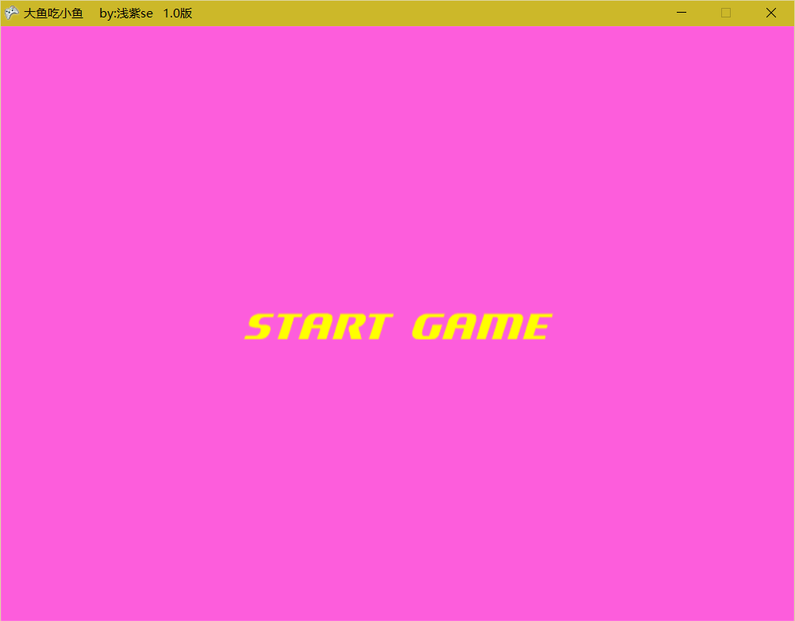

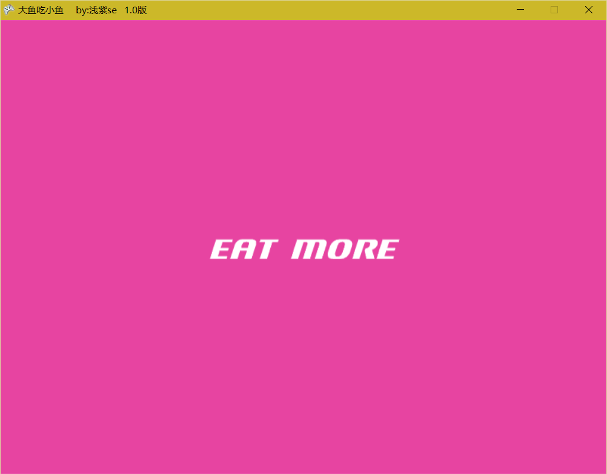

图6-1 游戏开始画面

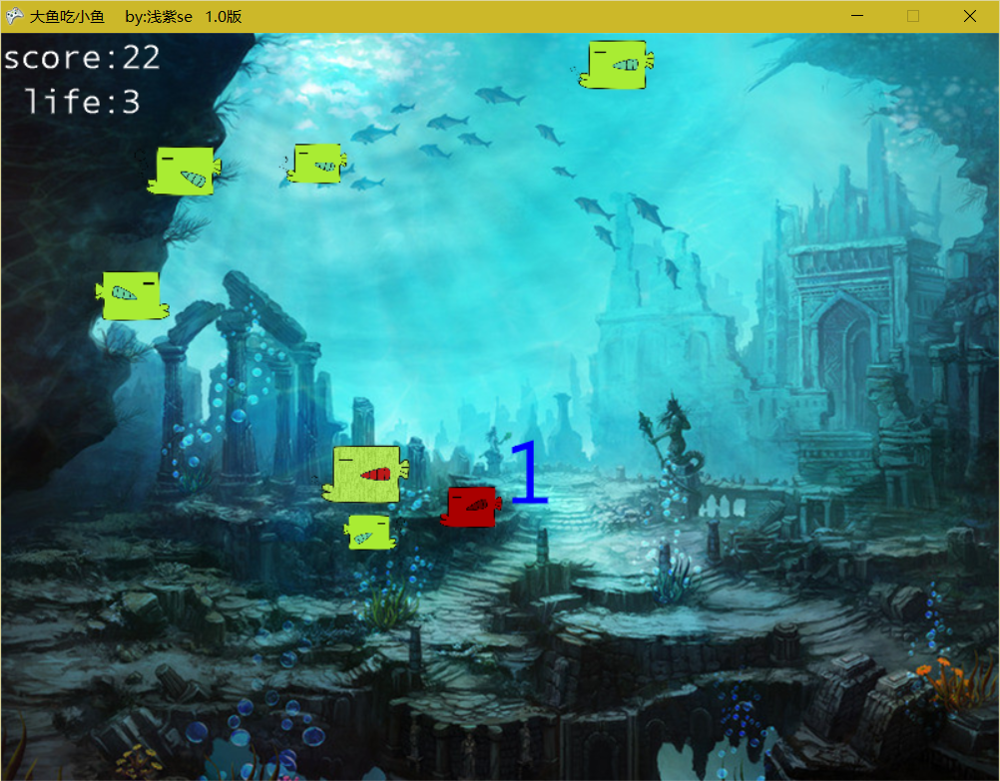

图6-2游戏进行时候的画面

每次添加新功能后都会进行测试,从刚刚开始开发到现在,已经遇到了很多BUG问题

| BUG                      | 是否解决 |
|--------------------------|----------|
| 游戏结束画面无法正确显示 | 是       |
| 文字只显示部分           | 是       |

第七章 总结与展望

课程设计和现代计算机技术的实际应用相结合，是我们在本阶段学完理论课程之后对自己该方面的能力的一次很好的检验，从开始的算法思路到运行调试后的美观的图形界面以及最后的游戏成品，都是一个很好的学习和锻炼的过程。使我巩固了原有的理论知识，培养了我灵活运用和组合集成所学过知识及技能来分析、解决实际问题的能力。使我体会到自身知识和能力能在实际中的应用和发挥。不但可以激发创新意识，还可以开发创造能力、培养沟通能力。课程设计的时间虽然不长,但确实使我受益非浅。通过实习我丰富了计算机操作经验，更加深了对C\#语言的了解
我加深了对编程了理解,了解了XNA游戏框架的基本搭建和使用方法,再次强化了自己的编程水平增强了对编程的兴趣爱好.

另外,最重要的是,由于之前课外学习了相关编程模式的内容,这次的编程实践,让我对编程模式有了更加直观的感受和更加清晰的认识,再次深入了解了编程模式的使用和设计还有它的使用场景,也真正领略到了编程模式给程序员写代码的时候带来的巨大的好处,特别是当你有了一个好的设计的时候,面对源源不断的修改要求的时候,你可以不再花费原来那么多的精力去维护和修改你原有的代码,这是在以后工作中会让你十分收益的地方.
